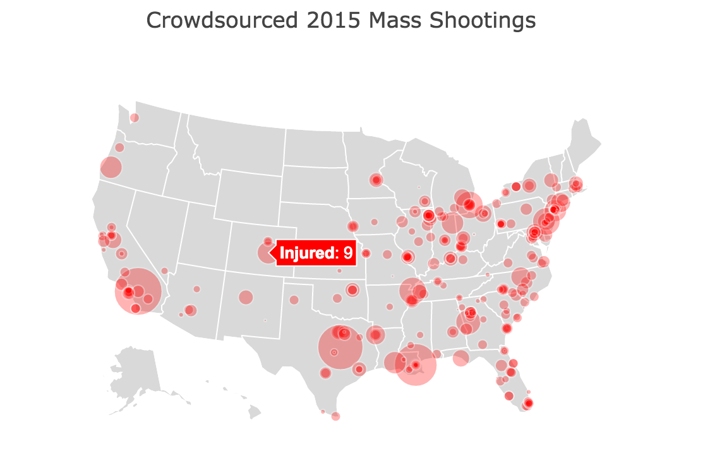

## Exercise 1: Mapping Shooting Data

In this exercise, you'll use the `Plotly` library to create an interactive map of crowdsourced shooting data in the United States. Start by forking and cloning this repository. Then, edit the `js/main.js` to complete the outlined steps. You'll create an interactive map that looks like this:

## Mass shooting data
There is already a file `Mass-Shooting-Data.csv` inside of the `data/` directory for you to use. This data originally was crowdsourced on <a href="http://www.shootingtracker.com/wiki/Mass_Shootings_in_2015" target="_blank">this website</a>, though I've added latitude and longitude to make mapping easier (if you're curious how I did that, check out <a href="http://github.com/mkfreeman/geolocate-shootings" target="_blank">this repo</a>). As mentioned, this is sensitive data, so please be mindful in how you represent it.

You may find the following resources helpful:

- [Plotly Bubble Maps](https://plot.ly/javascript/bubble-maps/)
- [Plotly Geography Layout Docs](https://plot.ly/javascript/reference/#layout-geo)

See the `complete` branch for answers.
